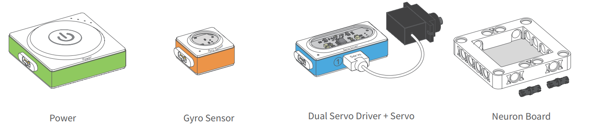

# Neuron 3 Projects
_Science and Learning, Project 57_

Great for the little ones, this month we've provided you with 3 projects with different levels of difficulty and all utilizing only a single [Makeblock Inventor Kit](https://www.jaycar.com.au/p/KJ9190).

Using the makeblock app [neuron](https://play.google.com/store/apps/details?id=neuron.makeblock.com), one can learn about the different sensors and how to fit them in a project. But don't worry, these projects are designed to be simple enough to let the kids play, and learn what they can achieve!

## Bill of Materials:

|Quantity | Part | Description
|---|---|---|
|1|[KJ9190](https://www.jaycar.com.au/p/KJ9190)| Makeblock Neuron Kit |

The projects are arranged from easiest to hardest, and only take a couple of minutes to set up

## Project 1: Musical Fruit
This is a simple project to get started. Use the following three modules from your neuron inventor kit:
* Power
* Funny Touch and cables
* Buzzer

and connect as shown:

The modules will magnetically clip into each other. The cables of the funny touch should also be attached, with the GND cable on the top of the module, and the Funny cable attached to the bottom. if you find that the device doesn't work properly, try switching these cables around.

Find some fruit or other household items to connect to each of the coloured alligator clips, as well as the GND alligator clip, then put a hand on each of the household items and listen to the music. try to make a fruit musical, or tell a story with the different items.

## Project 2: Tail Wagging Cat
This project steps up the pace a little bit with a bit of construction. Use the following 3 modules:
* Power
* Gyro sensors
* Servo module and servo (with arm, shown in 2nd picture below)

Set aside to connect later.

You should find in your kit a foldable box with glue tags and some stencils for the tails and ears. You can begin constructing the box, making sure not to poke out every hole as we have done.

Take one of the tails and slide through the servo arm, so that the servo can attach to the coloured side of the tail. Slide the servo connection in the back of the box (opposite the big hole) as shown:

Then attach the servo to the tail, and slide the servo to fit nicely into the hole that the cable has entered:

then open the lid of the box, and place in the modules, connecting in order as shown:

Below is a picture showing our connections, you do not have to turn it on yet, as the tail will begin wagging.

The Neuron Board is used to create a face on the front of the box. Using little pipe joiners, connect two boards together and use 4 to act as pins to hold it into the front of the box:

_six pins are used here_

You can then use a whiteboard marker to draw a face on it. The face of the neuron boards are whiteboard marker friendly.

we have also attached the ears to the box, which simply sit in the little slots at the top. Do not glue them in, as they will not be able to bounce and move around while glued.

With the tail, ears, and face on, the robot cat is complete.

turn the power unit on and pat the cat on the head. it should respond like this:

## Project 3: Multiple Faces

This is the hardest project of the 3, but still fairly easy for the older children. It involves programming and is a great start with learning the logic behind computer and engineering systems with inputs and outputs. First step is to install the app:

Search the google play or apple stores for "Neuron"

You will need 4 modules for this project to work:
* Bluetooth module
* Power module
* Funny Touch
* LED panel

Connect in order as shown:

_Make sure that the bluetooth module is to the left of the power module_

If you turn the unit on now, you will find that the LED screen lights up depending on what colour alligator clip touches the ground clip. We will now program using the neuron app to change what the LED panel displays.

Open up the app, and press "Code", then "New Project"

it will then ask you to connect to the blocks; turn on the power block and press "Bluetooth connection" in the app. Hold them close together and they should connect automatically.

If the app warns you about firmware updates it is best to do those all at once, as different versions of firmware will not communicate. For now you can skip, but make a mental note to change through each of the blocks and update them later.

When you are in a new neuron project, and you have your blocks connected, you should see them appear at the top of the screen.

Drag the orange funny touch to the left side, and the LED panel to the right. Then, double tap on the LED panel and you should see an image option appear.

Drag the image into a suitable location to give you plenty of room, and connect between one of the funny touch colours on the left side, and the LED panel on the right side.

You can now press on the image to open the image editor, this will allow you to select a few different faces, or to edit your own.

Confirm the changes and make 3 more images, change the first 3 to use the 3 different face presets, and with the final one, use the image editor to make a "crazy" face.

_artistic skill not required_

You can also use the plus sign on the left hand side of the image to make a moving pattern. Click on the face icon (rightmost crayon with the face on it) to add a pre-set face. then use the plus icon to make a new page and add a heart. This will flash a green smiley and a heart on the LED Panel.

Connect all 4 faces to different inputs of the funny touch as shown

You can now connect some objects to each of the alligator clips, and watch different faces and images show up on the LED panel. If you are very creative, try using some of the basic controls on the bottom of the screen and figure out what they do.

### Congratulations
You have just taken an exciting step in a new direction of engineering and programming. You've made a robot cat, a musical keyboard, and an interactive display. Engineers use many of these types of blocks to build bridges, programs, computers and machines. With your Neuron kit you will be able to make all sorts of wonderful creations.

If you enjoyed these projects, please feel free to mention neuron on our facebook page so that we can make more.

#### Notes and errata
* Be sure to read the KJ9190 manual so you get a better understanding of block connections and common mistakes
* having multiple blocks CAN cause issues depending on set up, usually output blocks (blue) will use the input of their closest input neighbour (orange) from the left.
* We have created a project controller in our hardcore catalog that can interface with this project. Check out "rPi Project Controller" on our [project pages](https://jaycar.com.au/arduino) or on [github.com/duinotech](https://github.com/duinotech).
